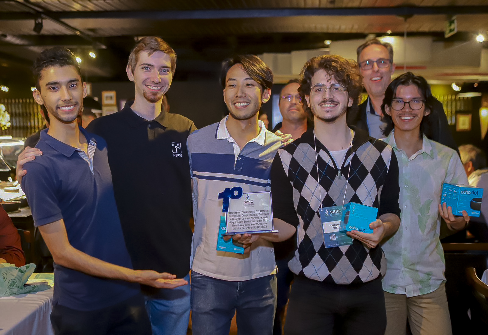

# SBRC Hackathon 5G Dataset Challenge
1st place in the SBRC 2023 Hackathon organized by Ericsson and Unicamp in the context of 5G. The objective was to develop solutions and insights using machine learning on 5G network data in Brazil. This repository contains the solution provided by the UnBetas 5G group in the Hackathon, as well as all the files from the [event repository](https://github.com/intrig-unicamp/hackathon5G/tree/main).

The Brazilian Symposium on Computer Networks and Distributed Systems (SBRC) is the most relevant annual event in Brazil for researchers, academics, and industry professionals in computer networks and distributed systems. It fosters collaboration, knowledge exchange, and innovation, covering topics such as network protocols, cloud computing, cybersecurity, and IoT and SBRC plays a vital role in shaping the future of these fields in Brazil through presentations, networking, and addressing emerging trends and challenges.

# Description
The SMARTNESS / 5G Dataset Challenge Hackathon aims to stimulate the development of innovative solutions and the creation of insights using datasets (provided by the SMARTNESS Hackathon organizing committee) composed of adaptive video streaming (YouTube) and 5G network usage data in Brazil. To support problem solving, teams can use auxiliary datasets for data enrichment.

Teams can develop their projects in various areas, such as exploratory data analysis, development of innovative insights using 5G and the provided datasets, machine learning models for prediction, classification, clustering, decision support, development of application performance models in the context of 5G, and much more.

# Execution
The [solution](https://github.com/alexandrekaihara/SBRC-Hackathon-5G-Dataset-Challenge/blob/main/UnBetas_5G_Solution.ipynb) from UnBetas 5G can be executed in an environment like Google Colab. Just make a copy and run it in these environments. The Solution file contains the resolution of all the [challenges](https://github.com/alexandrekaihara/SBRC-Hackathon-5G-Dataset-Challenge/tree/main/challenges) and their respective storytelling.

